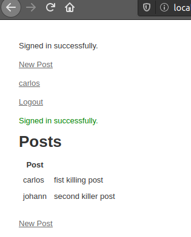

# Project MEMBERS ONLY

# Description

> This is an online applications that allows registered users to create and publish post. Shows the created posts on a public list, letting the author of each post to be on display only to valid existing users

## Built With

- Ruby on rails
- Vscode
- Atom

## Requisites

- Ruby on rails 5.2.4.2
- Ruby 2.6.5

## Getting Started

- You can clone this repository locally by using: git clone git@github.com:JohannRodriguez/bare-metal.git
- To use it get into the repository folder on your terminal and use the comand rails server.
- Go to your browser and type http://localhost:3000/users/new to see the page.

## Authors

👤 **Johann Rodríguez**
- Github: [@JohannRodriguez](https://github.com/JohannRodriguez)
- Twitter: [@BSapce](https://https://twitter.com/BSapce)
- Linkedin: [Johann Rodríguez](https://www.linkedin.com/in/johann-alonso-rodr%C3%ADguez-v%C3%A1zquez-25b07719a/)

👤 **Carlos Prieto**
- Github: [@carlosprietobarron](https://github.com/carlosprietobarron)
- Linkedin: [Carlos Prieto](https://www.linkedin.com/in/carlos-prieto-41a2b018b/)
- Email: [Carlos Prieto Barrón](carloprietobarron@gmail.com)

## 🤝 Contributing

Contributions, issues and feature requests are welcome!

Feel free to check the [issues page](https://github.com/carlosprietobarron/members_only/issues).

## Show your support

Give a ⭐️ if you like this project!

## Acknowledgments

- The odin project

## 📝 License

This project is [MIT](lic.url) licensed.
